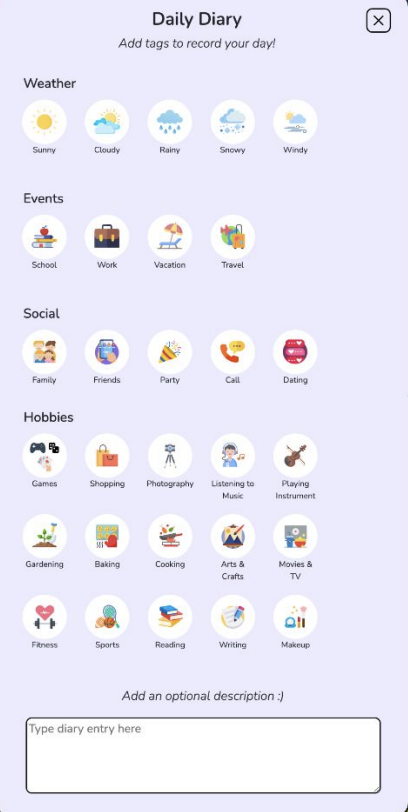

# *happy paws*: A Gamified Approach to Mental Health

**"happy paws"** was developed as a capstone project at the University of Washington, Information School. It is a website catered towards Gen Z to promote the development of healthy habits, self-reflective journaling, and mood tracking. Built using HTML, CSS, JavaScript, React, Firebase, and Node.js, the platform aims to foster mental wellness through a user-friendly, supportive, and engaging online environment. 

#### Developers:
* Clarabelle McKeirnan
* Sara Hamidi
* Aliya Ali

#### Collaborators:
* Melanie Kuo
* Srishti Singh

## Project Resources

* [University of Washington iSchool Submission](https://ischool.uw.edu/capstone/projects/2024/happy-paws-gamified-approach-mental-health)
* [Final Project Presentation](https://ischool.uw.edu/sites/default/files/capstone/2024/11647/happy-paws-final.pptx.pdf)
* [happy paws app](https://healthyminds-45655.web.app/)

## Features

### 1. Daily Check-in
Users are prompted to complete a check in that tracks their daily mood, promoting self-reflection and emotional awareness. By completing a check-in, users are awarded with coins and an increase in their pet's health.

### 2. Diary Entries & Tags
Users may enter key details about their day including the weather, special events, social activities, participation in hobbies, etc and write a diary entry about their day. They can look back at the entries in their profile and notice top-used tags to reflect upon their positive habits. 

### 3. Store
The primary incentive for users to continue using the daily check-in and diary features. By increasing their coin count, users can buy clothes, necessities, and even upgrade their pets. They may then change their pet's outfit on the home page and give them new toys. 

## Technologies Used
- **Frontend**: React, HTML, CSS
- **Backend**: Node.js
- **Database**: Firebase
- **Other Tools**: Git, Figma, Miro

## Project Goals
1. **Increase Mental Health Awareness**: Encourage users to be in tune with their mental health.
2. **Promote Healthy Daily Habits**: Offer a visually-appealing platform that enables users to practice journaling and self-reflection.
3. **Destigmatize Mental Health**: Contribute to the destigmatization of difficult discussions surrounding mental health. 

## Future Improvements
- Notification system
- Connections to external resources
- In-app tutorial
- More robust user insights
  
---

